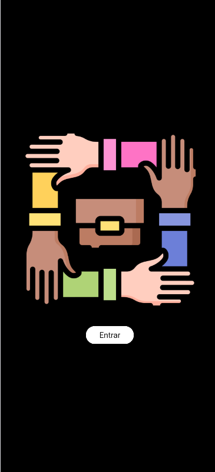
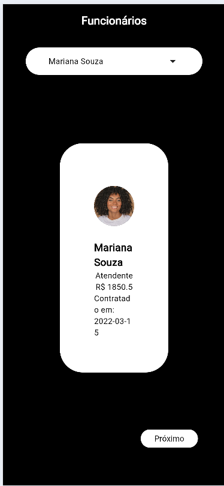
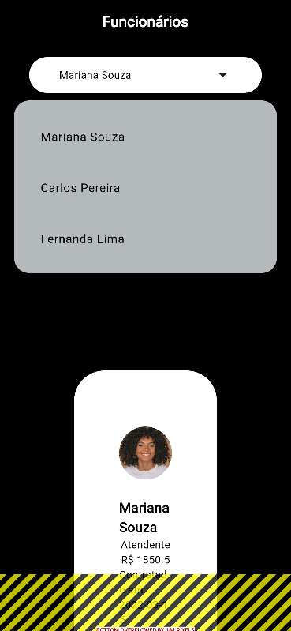

# 👩‍💻 Flutter Funcionários

Sistema desenvolvido em Flutter para gerenciamento de funcionários.

---

## 🚀 Sobre o projeto

Este projeto tem como objetivo facilitar o controle de funcionários, permitindo cadastro, visualização e organização das informações de forma simples e eficiente.

---

## 🛠️ Tecnologias utilizadas

- Flutter
- Dart
- Material Design

---

## 📱 Funcionalidades

- 📌 Cadastro de funcionários  
- 📋 Listagem de funcionários  
- 🔍 Visualização de detalhes  

---

## 🎨 Interface

Interface moderna, responsiva e intuitiva, pensada para facilitar a usabilidade.

---

## ▶️ Como executar

```bash
git clone https://github.com/gabsouza05/flutter_funcionarios.git
cd flutter_funcionarios
flutter pub get
flutter run

```

---

## 📸 Screenshots

<p align="center">
  
  
  
</p>
